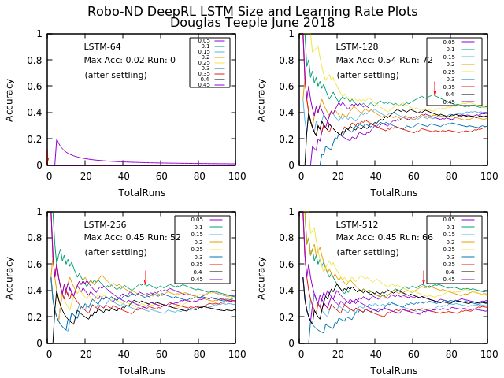

# Deep RL Arm Manipulation

This project is based on the Nvidia open source project "jetson-reinforcement" developed by [Dustin Franklin](https://github.com/dusty-nv). The goal of the project is to create a DQN agent and define reward functions to teach a robotic arm to carry out two primary objectives:

1. Have any part of the robot arm touch the object of interest, with at least a 90% accuracy.
2. Have only the gripper base of the robot arm touch the object, with at least a 80% accuracy.


## Building from Source (Nvidia Jetson TX2)

Run the following commands from terminal to build the project from source:

``` bash
$ sudo apt-get install cmake
$ git clone http://github.com/udacity/RoboND-DeepRL-Project
$ cd RoboND-DeepRL-Project
$ git submodule update --init
$ mkdir build
$ cd build
$ cmake ../
$ make
```

During the `cmake` step, Torch will be installed so it can take awhile. It will download packages and ask you for your `sudo` password during the install.

## Challenge Part 3

### 1. Object Randomization
In the project, so far, the object of interest was placed at the same location, throughout. For this challenge, the object will instantiate at different locations along the x-axis. Follow these steps and test your solution:

In PropPlugin.cpp, redefine the prop poses in PropPlugin::Randomize() to the following:

``` c++
pose.pos.x = randf(0.02f, 0.30f);
pose.pos.y = 0.0f;
pose.pos.z = 0.0f;
```

In ArmPlugin.cpp, replace ResetPropDynamics(); set in the method ArmPlugin::updateJoints() with RandomizeProps();

### 2. Increasing the Arm’s Reach
As you might have noticed in the gazebo-arm.world file, the arm’s base has a revolute joint. However, in the project, that was disabled to restrict the arm’s reach to a specific axis. In this challenge, the object’s starting location will be changed, and the arm will be allowed to rotate about its base. Follow these steps to try this challenge:

In gazebo-arm.world, modify the tube model’s pose to [0.75 0.75 0 0 0 0]
In ArmPlugin.cpp, set the variable LOCKBASE to false.
In ArmPlugin.cpp, replace RandomizeProps(); set in the method ArmPlugin::updateJoints() with ResetPropDynamics();

### 3. Increasing Arm’s Reach with Object Randomization
This challenge will build on top of the previous challenge:

In gazebo-arm.world, modify the tube model’s pose to [0.75 0.75 0 0 0 0]
In ArmPlugin.cpp, set the variable LOCKBASE to false.
In ArmPlugin.cpp, replace ResetPropDynamics(); set in the method ArmPlugin::updateJoints() with RandomizeProps();
In PropPlugin.cpp, redefine the prop poses in PropPlugin::Randomize() to the following:

``` c++
pose.pos.x = randf(0.35f, 0.45f);
pose.pos.y = randf(-1.5f, 0.2f);
pose.pos.z = 0.0f;
```
In PropPlugin.cpp in the onUpdate() function, add a small velocity so the cylinder moves:

``` c++
// Apply a small linear velocity to the model.
	this->model->SetLinearVel(math::Vector3(.03, 0, 0));
```


